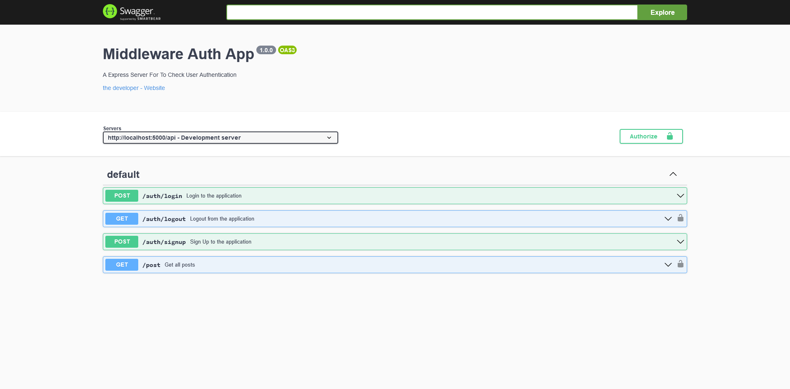

# Q2 Middleware Demo App

- Backend App With Login, Logout and Sign Up. Middleware Checks is user Auhtenticated if yes sends post at `/api/post` endpoint. Swagger Docs available at `/api-docs` endpoint.
- Tech: Node.js, Express, cors, swagger-ui-express, dotenv, mongoose, MongoDB, yamljs, cooki-parser, argon2, jsonwebtoken

### Live Link: [https://express-jwt-demo.onrender.com/api-docs](https://express-jwt-demo.onrender.com/api-docs)

### Screenshot

