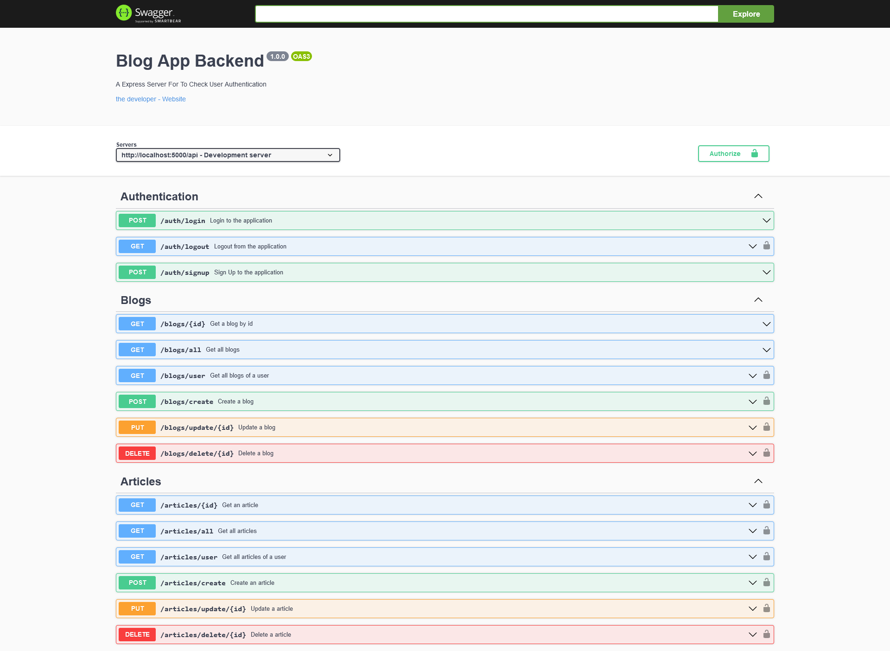

# Q3 Blog App

- Backend App With Login, Logout and Sign Up.
- CRUD Operatios for Articles.
- CRUD Operations for Blogs.
-  Swagger Docs available at `/api-docs` endpoint.
- Tech: Node.js, Express, cors, swagger-ui-express, dotenv, mongoose, MongoDB, yamljs, cooki-parser, argon2, jsonwebtoken

### Live Link: [https://crud-blog-app.onrender.com/api-docs](https://crud-blog-app.onrender.com/api-docs)

### Screenshot

