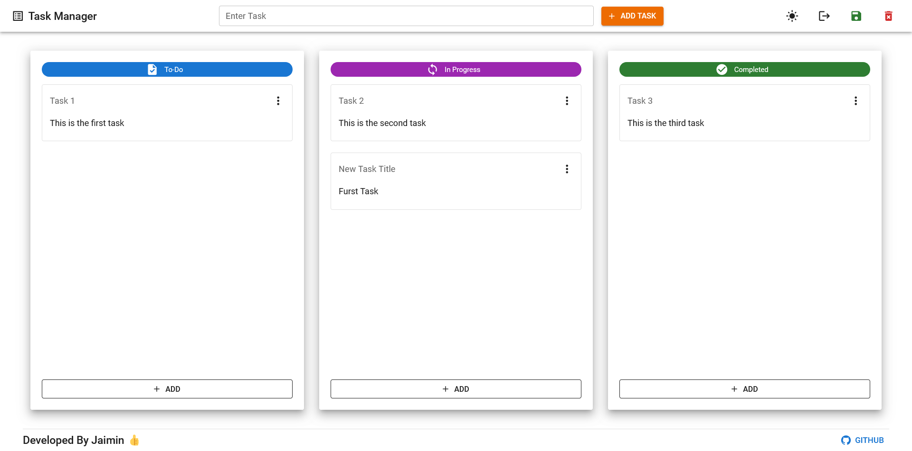

# Q16 Tic Tac Toe App Using Class Components

- Tech: HTML5, CSS3, Material UI, Material Icons, JavaScript, React, React Router, axios, Redux Toolkit, localforage, React-DnD

### Live Link: [https://646d104c7627af3abbb9a6c8--statuesque-truffle-c11aad.netlify.app/](https://646d104c7627af3abbb9a6c8--statuesque-truffle-c11aad.netlify.app/)

### Screenshot

